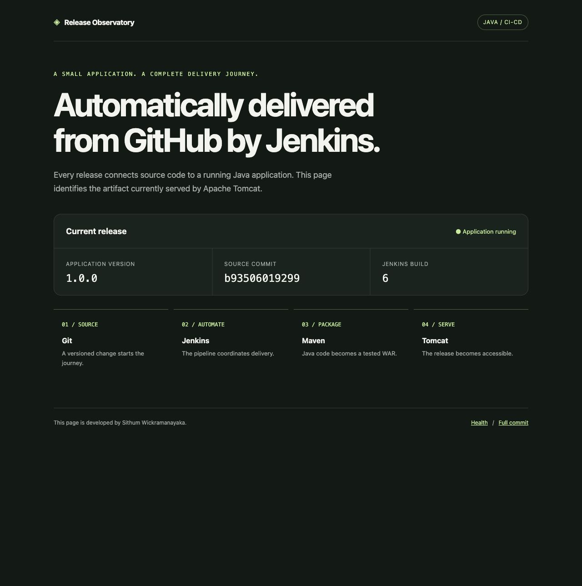
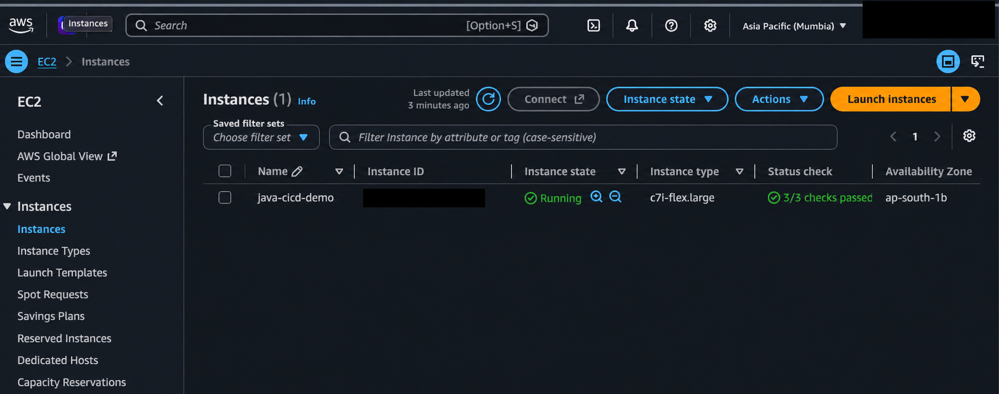
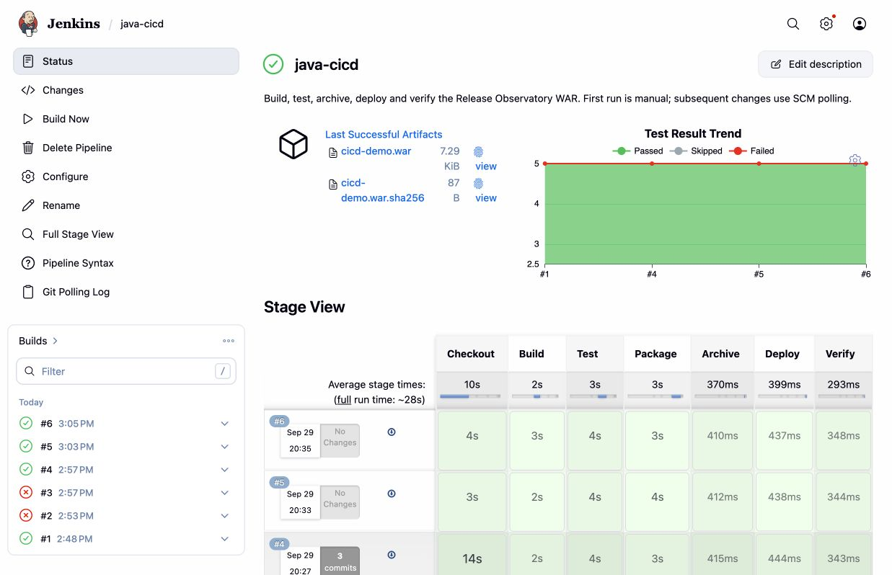
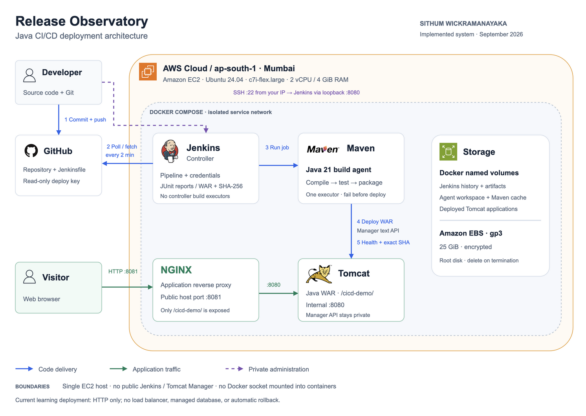

# Release Observatory — Java CI/CD Pipeline

**Developed by Sithum Wickramanayaka**

Design and Implementation of a CI/CD Pipeline for a Java Web Application Using Jenkins, Maven, and Apache Tomcat

Release Observatory is a small Java web application that makes a deployed release identifiable by its version, source commit, and Jenkins build number. The project demonstrates source checkout, compilation, automated testing, WAR packaging, artifact archiving, Tomcat deployment, and HTTP verification.

## Live demo and screenshots

[Open the temporary AWS demo](http://13.204.65.27:8081/cicd-demo/) · [Evidence gallery](docs/evidence/README.md) · [Project report](docs/report.md)

The demo uses HTTP on port 8081 and is available while the temporary EC2 server runs. Its public IP may change after a stop/start. Jenkins is private and requires an SSH tunnel; there is no public administrator login. The AWS Free Plan consumes credits and is not permanent free hosting.



### AWS EC2 hosting

The project runs on the `java-cicd-demo` EC2 instance in Mumbai, using `c7i-flex.large`. The supplied console screenshot shows **Running** and **3/3 checks passed**.



*Redacted copy of the supplied AWS console screenshot. Account details and the instance ID are hidden; visible deployment facts were checked against the original. The unredacted original is retained locally and excluded from Git.*

### Verified outcomes

| Scenario | Environment | Recorded result |
| --- | --- | --- |
| Build, test, archive, deploy and verify | Local #1 / AWS #1 | Successful delivery from a private GitHub repository |
| Visible update detected by SCM polling | Local #2 | Automatically deployed commit `3da6be3` |
| Deliberately failing test | Local #3 | Deployment skipped; previous release kept running |
| Corrected test | Local #4 | Five passing tests and successful recovery |
| Author credit in footer | AWS #4–#6 | Commit `b935060` deployed successfully |

Results and screenshots were recorded on September 29, 2026. They are historical evidence, not a live status badge. AWS #2/#3 encountered GitHub SSH authentication failures; a retry succeeded. These are distinct from the intentional local test failure.



## Technology

Java 21 · Maven 3.9.11 · JUnit 5 · Jenkins 2.568.3 · Apache Tomcat 10.1.60 · Nginx 1.28.0 · Docker Compose · Ubuntu 24.04 on AWS EC2.

The app is packaged as a WAR using Jakarta Servlet 6. Its homepage, `/health`, and `/version` make the deployed build observable. Exact runtime versions are saved in the [evidence folder](docs/evidence/README.md).

## Architecture



[View full-size SVG](docs/architecture/architecture.svg) · [Download editable draw.io source](docs/architecture/architecture.drawio) · [Diagram guide and icon credits](docs/architecture/README.md)

Jenkins administration binds to the server's loopback interface and is reached through an SSH tunnel. The public proxy serves only `/cicd-demo/`; Tomcat Manager has no published host port. Jenkins builds run on a dedicated agent, not on its controller. No service mounts the Docker socket.

## Start here

1. Follow [setup](docs/setup.md) for local containers or a fresh Ubuntu server.
2. Follow [AWS deployment](docs/aws.md) when launching the temporary Free Plan server.
3. Browse the [captured evidence](docs/evidence/README.md), or repeat the [demonstration](docs/demonstration.md).
4. Read the [report](docs/report.md) for results, tradeoffs, troubleshooting and improvements.
5. Follow [teardown](docs/teardown.md) after exporting evidence.

## Quick start

Prerequisites: Docker Engine/Desktop with Compose v2, Git, Python 3, and about 4 GB of available memory for the stack. Downloading images and plugins requires internet access.

```bash
git clone https://github.com/suwickramanayaka/java-jenkins-maven-tomcat-cicd.git
cd java-jenkins-maven-tomcat-cicd
python3 scripts/configure.py \
  --repository https://github.com/suwickramanayaka/java-jenkins-maven-tomcat-cicd.git \
  --ssh-deploy-key
docker compose up -d --build
docker compose ps
```

Register `.secrets/github_ssh_key.pub` under repository **Settings → Deploy keys**, leaving write access disabled. Omit `--ssh-deploy-key` for a public repository. Alternatively, `--private-repository` prompts locally for a repository-scoped read-only token. Never place credentials in a URL or commit them.

- Jenkins: http://localhost:8080/ (username `admin`)
- Administrator password: read `.secrets/jenkins_admin_password` privately.
- Pipeline job: `java-cicd`. Choose **Build Now** once to establish polling.
- Application after deployment: http://localhost:8081/cicd-demo/

Generated secrets remain under `.secrets/`, which Git ignores. `.env` contains repository and network settings and is also ignored.

## Build without Jenkins

From a directory whose path contains no colon, with Java 21 and Maven:

```bash
mvn -B -ntp clean verify
```

The WAR is `target/cicd-demo.war`. Java classpaths use `:` as a separator on macOS/Linux; a directory name containing `CI:CD` can therefore break a host Maven build. Use the short clone directory above or build inside the container.

## Pipeline behavior

| Stage | Outcome |
| --- | --- |
| Checkout | Clean workspace, checkout configured branch, record full commit SHA |
| Build | Compile Java with release metadata |
| Test | Run required JUnit tests, publish reports even on failure |
| Package | Build WAR; Maven reruns tests as part of its lifecycle |
| Archive | Save WAR and SHA-256 checksum, fingerprint artifacts |
| Deploy | Upload the archived WAR's source file using a Jenkins credential |
| Verify | Require `UP`, the exact expected commit, and the homepage |

Failures stop later stages. Concurrent builds are disabled to prevent deployment races. A failure after deployment does not automatically restore the old application; rollback is a documented future improvement. The single-server design allows brief downtime during redeployment and is intended for this learning project.

## Repository layout

```text
src/                 Java servlet, release metadata and unit tests
Jenkinsfile          Seven-stage delivery pipeline
compose.yaml         Controller, agent, Tomcat and application proxy
infrastructure/      Container images, bootstrap and proxy configuration
scripts/             Configuration, Ubuntu setup, deployment and smoke checks
docs/                Setup, AWS guide, report, teardown and captured evidence
```

## Recreate later

Provision a fresh Ubuntu server, clone this repository, install Docker, regenerate local secrets, start Compose, and run the pipeline. GitHub holds the source and setup, not Jenkins history or credentials. A new server can have a new IP address. AWS Free Plan eligibility and remaining credits must be checked again; recreating a server does not renew them.

## References and attribution

- [Jenkins Pipeline documentation](https://www.jenkins.io/doc/book/pipeline/)
- [Jenkins Docker documentation](https://www.jenkins.io/doc/book/installing/docker/)
- [Maven lifecycle](https://maven.apache.org/guides/introduction/introduction-to-the-lifecycle.html)
- [Tomcat Manager API](https://tomcat.apache.org/tomcat-10.1-doc/manager-howto.html)
- [Docker Engine on Ubuntu](https://docs.docker.com/engine/install/ubuntu/)
- [AWS Free Plan](https://aws.amazon.com/free/)

Original project contributions include the release dashboard, release identity checks, tests, Jenkins bootstrap, deployment scripts, private management access, and reproducible documentation.

## Author

Developed by **Sithum Wickramanayaka** as a personal learning project.
