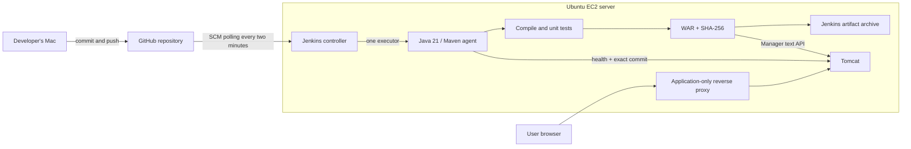

# Design and Implementation of a CI/CD Pipeline for a Java Web Application Using Jenkins, Maven, and Apache Tomcat

Release Observatory is a small Java web application that makes a deployed release identifiable by its version, source commit, and Jenkins build number. The project demonstrates source checkout, compilation, automated testing, WAR packaging, artifact archiving, Tomcat deployment, and HTTP verification.

## Architecture



Jenkins administration binds to the server's loopback interface and is reached through an SSH tunnel. The public proxy serves only `/cicd-demo/`; Tomcat Manager has no published host port. Jenkins builds run on a dedicated agent, not on its controller. No service mounts the Docker socket.

## Start here

1. Follow [setup](docs/setup.md) for local containers or a fresh Ubuntu server.
2. Follow [AWS deployment](docs/aws.md) when launching the temporary Free Plan server.
3. Run the [demonstration](docs/demonstration.md) and capture the required evidence.
4. Complete the [report](docs/report.md) with real build numbers, commits and URLs.
5. Follow [teardown](docs/teardown.md) after exporting evidence.

## Quick start

Prerequisites: Docker Engine/Desktop with Compose v2, Git, Python 3, and about 4 GB of available memory for the stack. Downloading images and plugins requires internet access.

```bash
git clone https://github.com/suwickramanayaka/java-jenkins-maven-tomcat-cicd.git
cd java-jenkins-maven-tomcat-cicd
python3 scripts/configure.py \
  --repository https://github.com/suwickramanayaka/java-jenkins-maven-tomcat-cicd.git \
  --ssh-deploy-key
docker compose up -d --build
docker compose ps
```

Register `.secrets/github_ssh_key.pub` under repository **Settings → Deploy keys**, leaving write access disabled. Omit `--ssh-deploy-key` for a public repository. Alternatively, `--private-repository` prompts locally for a repository-scoped read-only token. Never place credentials in a URL or commit them.

- Jenkins: http://localhost:8080/ (username `admin`)
- Administrator password: read `.secrets/jenkins_admin_password` privately.
- Pipeline job: `java-cicd`. Choose **Build Now** once to establish polling.
- Application after deployment: http://localhost:8081/cicd-demo/

Generated secrets remain under `.secrets/`, which Git ignores. `.env` contains repository and network settings and is also ignored.

## Build without Jenkins

From a directory whose path contains no colon, with Java 21 and Maven:

```bash
mvn -B -ntp clean verify
```

The WAR is `target/cicd-demo.war`. Java classpaths use `:` as a separator on macOS/Linux; a directory name containing `CI:CD` can therefore break a host Maven build. Use the short clone directory above or build inside the container.

## Pipeline behavior

| Stage | Outcome |
| --- | --- |
| Checkout | Clean workspace, checkout configured branch, record full commit SHA |
| Build | Compile Java with release metadata |
| Test | Run required JUnit tests, publish reports even on failure |
| Package | Build WAR; Maven reruns tests as part of its lifecycle |
| Archive | Save WAR and SHA-256 checksum, fingerprint artifacts |
| Deploy | Upload the archived WAR's source file using a Jenkins credential |
| Verify | Require `UP`, the exact expected commit, and the homepage |

Failures stop later stages. Concurrent builds are disabled to prevent deployment races. A failure after deployment does not automatically restore the old application; rollback is a documented future improvement. The single-server design allows brief downtime during redeployment and is intended for this learning project.

## Recreate later

Provision a fresh Ubuntu server, clone this repository, install Docker, regenerate local secrets, start Compose, and run the pipeline. GitHub holds the source and setup, not Jenkins history or credentials. A new server can have a new IP address. AWS Free Plan eligibility and remaining credits must be checked again; recreating a server does not renew them.

## References and attribution

- Assignment: `Jenkins_Maven_Tomcat_Assignment_Specification.pdf` (retained locally).
- [Assignment's suggested tutorial](https://youtu.be/pRHIw-WAZsg): assignment reference; this implementation is independently written, not a claim to reproduce the video's code.
- [Jenkins Pipeline documentation](https://www.jenkins.io/doc/book/pipeline/)
- [Jenkins Docker documentation](https://www.jenkins.io/doc/book/installing/docker/)
- [Maven lifecycle](https://maven.apache.org/guides/introduction/introduction-to-the-lifecycle.html)
- [Tomcat Manager API](https://tomcat.apache.org/tomcat-10.1-doc/manager-howto.html)
- [Docker Engine on Ubuntu](https://docs.docker.com/engine/install/ubuntu/)
- [AWS Free Plan](https://aws.amazon.com/free/)

Original project contributions include the release dashboard, release identity checks, tests, Jenkins bootstrap, deployment scripts, private management access, and reproducible documentation. Review and adapt all generated work so you can explain it in your individual assignment.
