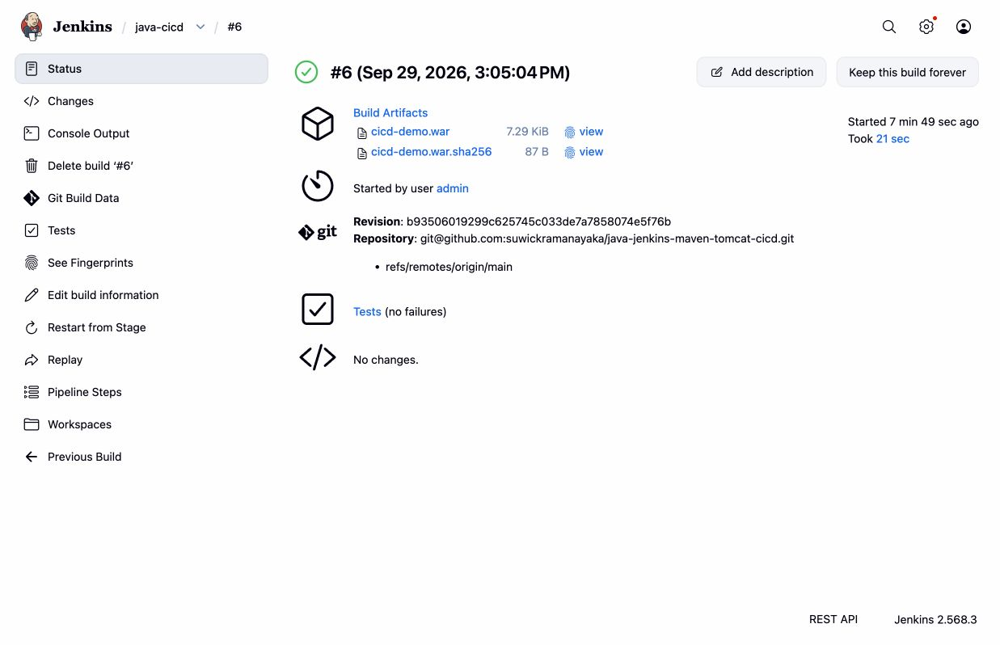
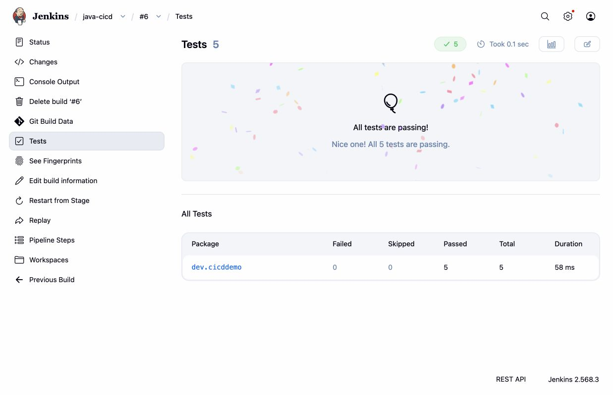
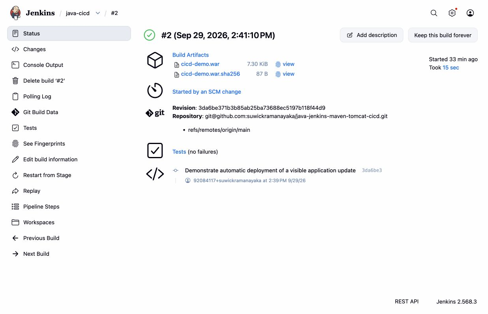
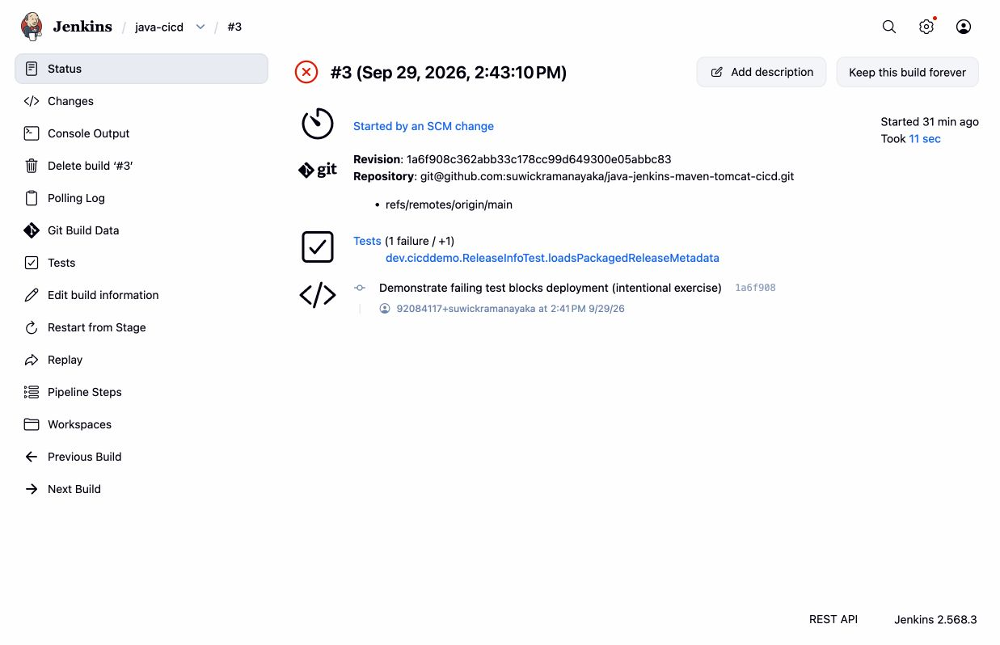
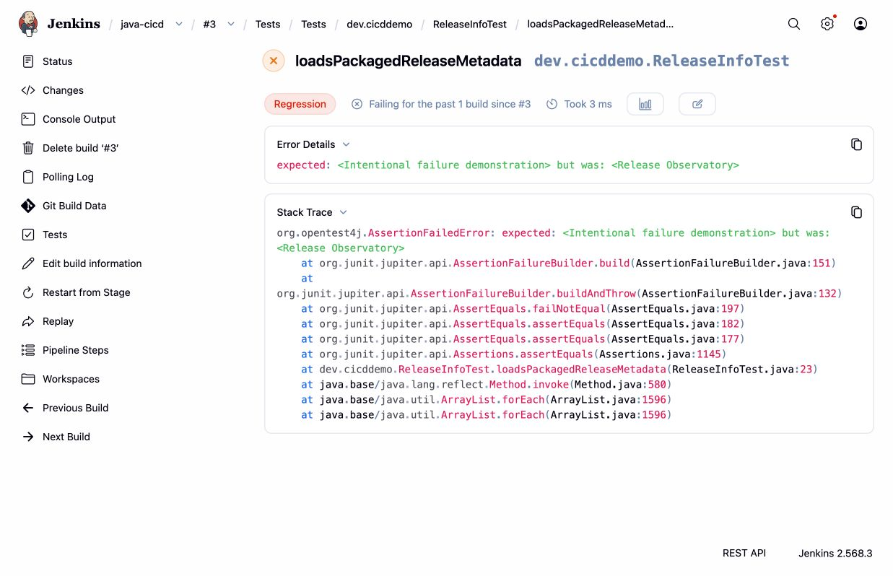
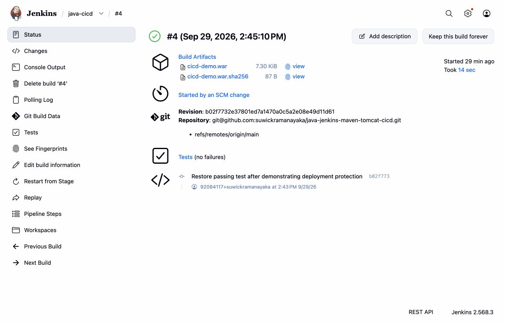

# Evidence gallery

Captured on **September 29, 2026**. Application and Jenkins screenshots are actual browser captures. The AWS console image below is an AI-assisted redacted copy of the user-supplied screenshot. Local Jenkins and AWS Jenkins have independent build numbers. The localhost address used to view AWS Jenkins is an SSH tunnel to EC2.

## AWS EC2 console

The user-supplied AWS console capture shows `java-cicd-demo`, instance type `c7i-flex.large`, state **Running**, status **3/3 checks passed**, region **Asia Pacific (Mumbai)** and zone `ap-south-1b`.

Account alias/number and the instance ID are covered with solid black boxes. This copy was edited using the built-in image-editing tool; the visible instance name, type, state, status checks and region were checked against the original. It is not an untouched screenshot. The original is retained in the ignored `private/` directory and is not published.

## Application on AWS

Commit `b935060`, AWS build **#6**, version **1.0.0**. The footer credits Sithum Wickramanayaka. The live demo is temporary; the screenshot remains available after server teardown.

## AWS pipeline

The seven delivery stages pass in build **#6**. Earlier AWS #2/#3 failures were GitHub SSH authentication errors, not the intentional test failure demonstrated locally. AWS #4 recovered and #5/#6 also passed.

## WAR and source identity

AWS **#6** associates the archived WAR and checksum with commit `b935060`. This build was started manually, as shown on its status page; automatic-trigger evidence is the separate local #2 capture below.

[Build metadata](aws-build-6.json) · [Console log](aws-build-6.log.txt) · [WAR SHA-256](aws-build-6-war.sha256)

## Passing tests

AWS **#6**: five tests, zero failures, zero skipped.

[JUnit results](aws-build-6-tests.json)

## Automatic change detection

Local **#2**, commit `3da6be3`: “Started by an SCM change,” with successful deployment of the updated message. See the [full log](local-build-2.log.txt) for deployment and exact-commit verification.

## Intentional failure and deployment protection

Local **#3**, commit `1a6f908`: the expected application name was deliberately changed to an incorrect value. The assertion failed, and later stages were skipped. The [console log](local-build-3.log.txt) records the skipped deployment; the [live-release check](local-failure-live-release.txt) records that local #2 stayed live.

## Recovery

Local **#4**, commit `b02f773`: restored the correct assertion. SCM polling triggered the run, tests passed, and deployment recovered.

## Environment and evidence files

| Files | Purpose |
| --- | --- |
| `local-build-1` through `local-build-4` | Original local success, automatic update, intentional failure and recovery; JSON metadata, JUnit reports and console logs |
| `aws-build-1.*` | Fresh Ubuntu EC2 environment and first successful deployment |
| `aws-build-6*` | Successful footer release and matching screenshot evidence |
| [Local environment](local-environment.txt) | Actual local runtime versions |
| [AWS environment](aws-environment.txt) | Actual cloud runtime versions and service status |

Logs were checked against generated project secrets and common credential patterns before committing. Screenshots omit credential-entry and AWS account pages. Build numbers and timestamps are historical; later runs may differ. The initial pre-update homepage was not captured as a saved image; its build log is retained instead.
